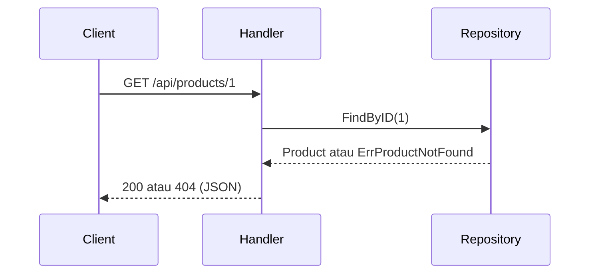

# Alur Request Product Service

## Penjelasan

| Lapisan | File | Tugas |
|---|---|---|
| Handler | `internal/handler/product_handler.go` | Menerima request HTTP dan menulis response JSON |
| Repository | `internal/repository/product_repository.go` | Mengambil data produk (saat ini dari memori) |
| Model | `internal/model/product.go` | Definisi struktur data produk |
| Response | `internal/response/response.go` | Format response standar |