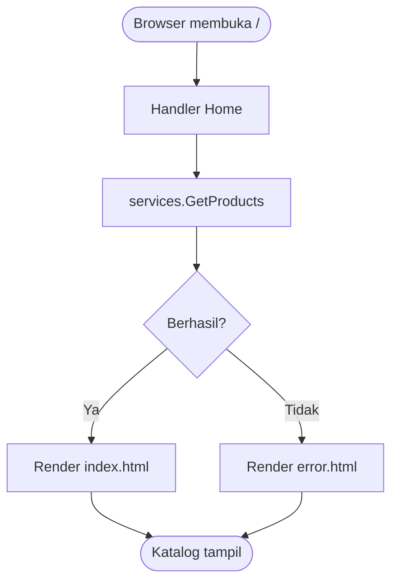

# Alur Halaman Katalog

```mermaid
flowchart TD
    A([Browser membuka /]) --> B[Handler Home]
    B --> C[services.GetProducts]
    C --> D{Berhasil?}
    D -->|Ya| E[Render index.html]
    D -->|Tidak| F[Render error.html]
    E --> G([Katalog tampil])
    F --> G
```
